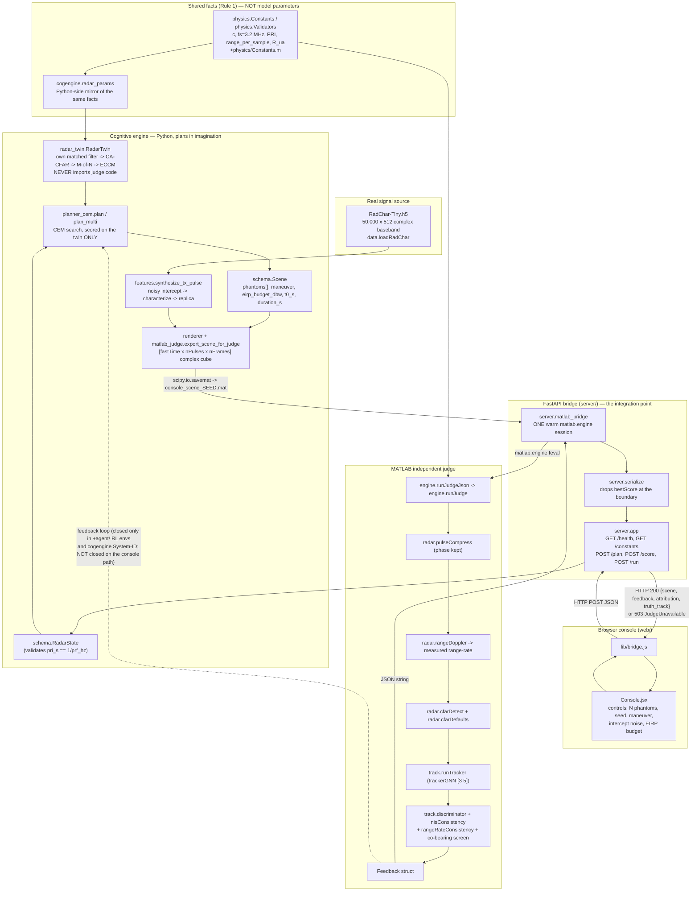
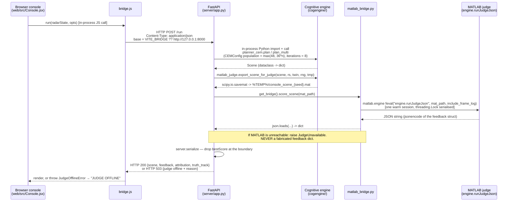

# ANNEXURE — Technical Inventory
### Team HAC-2026-1166 · swarm-radar-sim

**Compiled:** 5 August 2026. Every status and number below was produced by a command
run on that date on this machine. **No figure has been carried forward from
`CLAUDE.md`, `BENCHMARK_RESULTS.md`, `PHASE*_RESULTS.md`, `CLAIMABLE_RESULTS.md`, or
any other prior document** — those documents disagree with each other on several
metrics, which is exactly why this inventory re-measures rather than cites.

Where a number could not be produced today, it is marked as such and no substitute
is offered.


---

## A. Functional Blocks & Components

### A.1 Adversary side — `+synth/`, `+features/`, `+agent/`, `+engine/+entity/`

| Module | File path | Purpose (one line) | Status |
|---|---|---|---|
| `synth.synthesizeSwarm` | `+synth/synthesizeSwarm.m` | DRFM false-target generator: delay/phase/gain-shift an intercepted pulse into N phantom echoes | Implemented |
| `features.synthesizeTxPulse` | `+features/synthesizeTxPulse.m` | THE single synthesis entry point: intercept → characterize → gate → replicate | Implemented |
| `features.characterizeInterceptDechirp` | `+features/characterizeInterceptDechirp.m` | Nyquist-safe chirp characterization by dechirping against the known nominal rate | Implemented |
| `features.characterizeIntercept` | `+features/characterizeIntercept.m` | Blind phase-differencing characterization | Implemented, **documented-broken on this project's own waveform** (aliases at BW 2 MHz / fs 3.2 MHz; kept as the reference path, superseded by the dechirp version) |
| `features.coherentReplica` | `+features/coherentReplica.m` | Build a matched replica from extracted waveform parameters | Implemented |
| `features.buildChannelizer` / `channelize` / `featureVector` / `featureDistance` | `+features/*.m` | 16-channel PFB → 54-D feature vector + relative-L2 realism metric | Implemented |
| `agent.buildAgent` | `+agent/buildAgent.m` | Dueling Double-DQN (D3QN) agent over the DRFM action space | Implemented |
| `agent.buildAgentFeatureConditioned` | `+agent/buildAgentFeatureConditioned.m` | D3QN sized for the 57-D feature-conditioned observation | Implemented |
| `agent.buildEnv` | `+agent/buildEnv.m` | `rlFunctionEnv` wrapping a sequential DRFM-vs-radar engagement (45-action grid) | Implemented (legacy; retained as `synthesizeTxPulse`'s fallback target) |
| `agent.buildEnvWithFeatures` | `+agent/buildEnvWithFeatures.m` | Same engagement, feature-matched synthesis as the sole tx path | Implemented |
| `agent.buildEnvFeatureConditioned` | `+agent/buildEnvFeatureConditioned.m` | 57-D observation with the live PFB feature vector in-state | Implemented |
| `agent.buildEnvDoppler` | `+agent/buildEnvDoppler.m` | Feature-conditioned env with a real Doppler axis | Implemented |
| `agent.buildEnvEntity` | `+agent/buildEnvEntity.m` | D3QN action space *is* an entity state, rendered through the VEE | Implemented |
| `agent.exportPolicyWeights` / `policyForward` | `+agent/*.m` | Strip a trained D3QN to plain matrices; forward pass in matrix algebra | Implemented |
| `engine.entity.EntityState` | `+engine/+entity/EntityState.m` | One virtual entity's complete state — single source for all observables | Implemented |
| `engine.entity.propagate` | `+engine/+entity/propagate.m` | One dwell of CV dynamics, `s_{t+1} = F·s_t + w` | Implemented |
| `engine.entity.calibrateQ` | `+engine/+entity/calibrateQ.m` | Process-noise calibration (amplitude floor from real RadChar; kinematic Q is the declared knob) | Implemented |
| `engine.entity.render` | `+engine/+entity/render.m` | Emit range / Doppler / amplitude / micro-Doppler + monopulse Σ,Δ from that one state | Implemented |
| `engine.entity.checkCausality` | `+engine/+entity/checkCausality.m` | Refuse a phantom a repeater at `jammerRangeM` cannot physically place | Implemented |
| `engine.track.shadowEKF` | `+engine/+track/shadowEKF.m` | The engine's own estimate of the radar's predict/gate/update loop | Implemented |

### A.2 Judge side — `+radar/`, `+track/` (independent scorer)

| Module | File path | Purpose | Status |
|---|---|---|---|
| `radar.pulseCompress` | `+radar/pulseCompress.m` | Matched-filter (pulse compression) of a received pulse | Implemented |
| `radar.rangeDoppler` | `+radar/rangeDoppler.m` | Coherent slow-time Doppler integration over a range–pulse cube | Implemented |
| `radar.cfarDetect` | `+radar/cfarDetect.m` | CA-CFAR detection over a power vector | Implemented |
| `radar.cfarDefaults` | `+radar/cfarDefaults.m` | The judge's detector operating point, declared once | Implemented |
| `radar.agileWaveform` | `+radar/agileWaveform.m` | Per-dwell transmit waveform for an agile (sweep-reversal) schedule | Implemented |
| `radar.prfSchedule` | `+radar/prfSchedule.m` | Staggered PRI sequence (Tier 2.2) | Implemented |
| `radar.leadingEdge` | `+radar/leadingEdge.m` | Leading-edge range estimate (Tier 2.1 anti-DRFM counter) | Implemented |
| `track.runTracker` | `+track/runTracker.m` | `trackerGNN` over per-frame detections, with per-frame history output | Implemented |
| `track.trackerDefaults` | `+track/trackerDefaults.m` | The judge's tracker operating point, declared once | Implemented |
| `track.discriminator` | `+track/discriminator.m` | ECCM screen: is a confirmed track's signature physically consistent? | Implemented |
| `track.nisConsistency` | `+track/nisConsistency.m` | Multi-dwell track-consistency (NIS) test — Tier 1.1 | Implemented |
| `track.rangeRateConsistency` | `+track/rangeRateConsistency.m` | Textbook RGPO/VGPO detector — Tier 1.2 | Implemented |
| `track.amplitudeResidualScreen` | `+track/amplitudeResidualScreen.m` | Amplitude-consistency residual score (Phase 3.2b prototype) | Implemented (prototype; named as such in-file) |

### A.3 Shared physics — `+physics/` (Rule 1 constants; shared *facts*, not model parameters)

| Module | File path | Purpose | Status |
|---|---|---|---|
| `physics.Constants` | `+physics/Constants.m` | c, fs, PRI, range-per-sample, R_ua — every value derived or cited | Implemented |
| `physics.Validators` | `+physics/Validators.m` | Assert derived constants obey their defining relations | Implemented |
| `physics.linkBudget` | `+physics/linkBudget.m` | Real radar equation + real kT₀BF thermal-noise floor | Implemented |
| `physics.targetReturn` | `+physics/targetReturn.m` | What a genuine target actually puts into the receiver | Implemented |
| `physics.masqueradeErp` | `+physics/masqueradeErp.m` | ERP a repeater must transmit to impersonate a real target | Implemented |
| `physics.simUnits` / `simAmplitudeToWatts` / `wattsToSimAmplitude` | `+physics/*.m` | The one place the sim's amplitude unit meets watts | Implemented |
| `physics.apparentRange` | `+physics/apparentRange.m` | Where a beyond-R_ua echo actually appears (range folding) | Implemented |
| `physics.assertPrfWindowConsistent` | `+physics/assertPrfWindowConsistent.m` | A radar cannot listen longer than its PRI | Implemented |

### A.4 Seam, harness, assurance, UI backend

| Module | File path | Purpose | Status |
|---|---|---|---|
| `engine.runJudge` | `+engine/runJudge.m` | Score an exported scene's rx cube through the real judge chain | Implemented |
| `engine.runJudgeJson` | `+engine/runJudgeJson.m` | `runJudge` returned as a JSON string (the FastAPI bridge's actual entry) | Implemented |
| `engine.decideScene` | `+engine/decideScene.m` | MATLAB `radarState` → live `pyenv` call into `cogengine.planner_cem` → Scene struct | Implemented |
| `engine.sceneContract` | `+engine/sceneContract.m` | MATLAB mirror of `cogengine/schema.py` | Implemented (documentation-by-example, exercised by `tests/test_decideScene.m`) |
| `engine.sceneStructToJson` | `+engine/sceneStructToJson.m` | Guards `jsonencode`'s 1-element-struct-array → object collapse | Implemented |
| `data.loadRadChar` | `+data/loadRadChar.m` | Load RadChar from HDF5 | Implemented |
| `assurance.conformalFit` / `conformalPredict` | `+assurance/*.m` | Split-conformal calibration of engine belief vs judge outcome | Implemented |
| `assurance.simplexGuard` | `+assurance/simplexGuard.m` | Trust the high-performance controller, or fall back | Implemented |
| `assurance.provenanceLedger` | `+assurance/provenanceLedger.m` | Per-episode audit trail of every observable | Implemented |
| `+experiments/` (39 files) | `+experiments/*.m` | Benchmark harness + one-off measurement scripts (`runBenchmark`, `benchmarkSuite`, `eccmLadder`, `leverArm`, `screenAttribution`, `observerSweep`, `exchangeability`, …) | Implemented |
| `+missionsim/` (11 files) | `+missionsim/*.m` | Three-panel MATLAB `uifigure` mission simulator + frame-log schema/export/stream | Implemented |
| `+reports/` | `+reports/*.md`, `parse_exchangeability.py` | Generated assurance write-up + its parser | Implemented |

### A.5 Python cognitive engine — `cogengine/` (the ACTIVE package)

| Module | File path | Purpose | Status |
|---|---|---|---|
| `cogengine.schema` | `cogengine/schema.py` | The data contract crossing the Python↔MATLAB seam (`RadarState`/`MicroMotion`/`Phantom`/`Scene`/`Feedback`) | Implemented |
| `cogengine.renderer` | `cogengine/renderer.py` | Range delay, Doppler matched to range-rate, micro-Doppler, Swerling fluctuation | Implemented |
| `cogengine.radar_twin` | `cogengine/radar_twin.py` | The engine's INTERNAL belief about the radar (own matched filter → CFAR → M-of-N → ECCM). Never imports judge code. | Implemented |
| `cogengine.planner_cem` | `cogengine/planner_cem.py` | CEM/MPC scene search (`plan`, `plan_multi`) scored on the twin only | Implemented |
| `cogengine.features` | `cogengine/features.py` | Feature-matched synthesis, sole tx_template path | Implemented |
| `cogengine.matlab_judge` | `cogengine/matlab_judge.py` | Render a Scene to a `[fastTime × nPulses × nFrames]` cube and `savemat` it for the judge | Implemented |
| `cogengine.radar_params` | `cogengine/radar_params.py` | Python-side Rule 1 constants (the `+physics/` equivalent) | Implemented |
| `cogengine/fixtures/` | `cogengine/fixtures/*.py`, `*.m` | Manually-run validation/comparison scripts (not pytest-discovered) | Implemented |
| `cogengine/fixtures/historical_baseline/` | same | **Frozen** pre-single-path comparison fixtures | Frozen by design (not part of the active runtime) |
| `cognitive_engine/` (separate tree) | `cognitive_engine/cogengine/*.py` | **Reference implementation / stub tree.** `env.py`, `policy.py`, `estimator.py`, `truth_model.py`, `matlab_integration/`. `grep` for cross-imports from the active pipeline: none. | **Unused by the active pipeline** — reference only |

### A.6 FastAPI bridge — `server/`

| Module | File path | Purpose | Status |
|---|---|---|---|
| `server.app` | `server/app.py` | FastAPI app. `GET /health`, `GET /constants`, `POST /plan`, `POST /score`, `POST /run` | **Implemented — rewired 12 Aug 2026.** Between 7 and 12 Aug the four engine-touching endpoints returned 500 on the archived `cogengine`; `/health` kept working, because those imports were function-local. Now: `/plan` → `physics_projection.project_action` (a deterministic layout, **not** a search — the CEM planner has no replacement), `/score` → `export_plan_for_render` → `generator.render` → `engine.runJudgeJson`, `/constants` → `common.constants` |
| `server.matlab_bridge` | `server/matlab_bridge.py` | One of **two** sanctioned `matlab.engine` holders (the other is `generator/decision/matlab_bridge.py`, Phase C's training engine — see H1). Holds one warm session behind a lock; raises `JudgeUnavailable` → HTTP 503 rather than fabricating a verdict. Gained `render()` 12 Aug, since `+generator/render.m` has no Python equivalent by design | Implemented |
| `server.serialize` | `server/serialize.py` | Boundary filter: only `feedback` is a result; `bestScore` (planner imagination) is dropped at the seam | Implemented — and now stronger by construction: with no search there is no score to leak |
| `server.attribute` | `server/attribute.py` | Attribute judge tracks back to phantoms — deliberately outside the judge | Implemented |

**~~Known gap~~ — CLOSED 12 Aug 2026.** This entry read: *"`/run` reports
`angle_source: 'none'` because `cogengine.matlab_judge.export_scene_for_judge`
writes only the SUM channel… the PPI cannot draw real azimuth on this path."*
The rewire routes through `+generator/render.m`, which writes `rx_frames_delta`
whenever `IncludeAngleChannel` is set (now an exposed request option, defaulting
on). **Measured, not assumed:** `/run` returns `angle_source: 'monopulse'` and
`doppler_source: 'measured'`, and the N=2 co-bearing wall reproduces through the
API — 2 confirmed, 2 flagged, 0 surviving. `server/tests/test_generator_rewire.py`.

**One correction carried from H4:** the previous audit recorded this app as
unable to start. It started; only its endpoints failed. The distinction matters
because a dead process and a live process serving 500s need different
diagnoses.

### A.7 React console — `web/`

| Module | File path | Purpose | Status |
|---|---|---|---|
| Live Mission Console | `web/console.html`, `web/src/main-console.jsx`, `web/src/Console.jsx` | Browser control surface driving real plan+score cycles over HTTP | Implemented |
| Bridge client | `web/src/lib/bridge.js` | The ONLY place the client talks to the backend; surfaces 503 as `JudgeOfflineError`, never substitutes a result | Implemented |
| Log replay client | `web/index.html`, `web/src/MissionReplay.jsx` | Replays `missionsim.exportFrameLog` output; "Watch Live" NDJSON tail mode | Implemented |
| HiFi client | `web/hifi.html`, `web/src/MissionSimulatorHiFi.jsx` | Visually richer sibling, same real-data-only rule | Implemented |
| Components | `web/src/components/` | `Scene3D.jsx`, `Scene3DHiFi.jsx`, `PPIScope.jsx`, `RangeProfile.jsx`, `LineChart.jsx`, `BlockChain.jsx`, `Chrome.jsx` | Implemented |
| Frame-log libs | `web/src/lib/frameLog.js`, `liveFrameLog.js`, `consoleFrame.js` | Parse/normalise exported logs (incl. the `jsonencode` singleton-collapse guard) | Implemented |
| No-physics checker | `web/scripts/verify-no-physics.mjs` | Fails the build if any JS source contains CFAR/Kalman/tracker/planner tokens; includes a self-test with a planted violation | Implemented |

### A.8 External components

| Component | Detail | How obtained |
|---|---|---|
| **RadChar-Tiny** | `data/RadChar-Tiny.h5`, **380 MB** (398,773,081 bytes). Verified today with `h5py`: `/iq` = **(50000, 512) complex128**; `/labels` = **(50000,)** compound with fields `index`, `signal_type`, `number_of_pulses`, `pulse_width`, `time_delay`, `pulse_repetition_interval`, `signal_to_noise_ratio`. **50,000 signals**, 512 complex samples each, fs = 3.2 MHz, baseband. | Kaggle CLI: `kaggle datasets download -d abcxyzi/radchar-icassp-2023 -p E:\Radar\data --unzip`. Source: <https://www.kaggle.com/datasets/abcxyzi/radchar-icassp-2023> · schema <https://github.com/abcxyzi/RadChar> · paper arXiv:2306.13105. Credentials at `~/.kaggle/kaggle.json`, outside the repo. Git-ignored (`data/*.h5`). |
| **TSMS-Drone** | `data/TSMS-Drone/` — CW and FMCW drone/corner-reflector radar recordings + MATLAB example scripts. Used by `+experiments/analyzeTSMSCw.m` and `analyzeTSMSCornerReflector.m`. | See `data/DATASET_SURVEY.md`. `.7z` archives git-ignored. |

**MATLAB toolboxes actually imported** — established by `grep` for toolbox-specific
symbols across all `*.m`, then cross-checked against `ver` on this machine:

| Toolbox (installed, R2026a / v26.1) | Symbols this repo actually calls | Occurrences |
|---|---|---|
| Sensor Fusion and Tracking Toolbox | `trackerGNN`, `objectDetection` | 40, 42 |
| Phased Array System Toolbox | `phased.LinearFMWaveform`, `phased.CFARDetector`, `phased.FreeSpace`, `phased.MatchedFilter`, `phased.RadarTarget` | 33, 10, 4, 3, 2 |
| Reinforcement Learning Toolbox | `rlDQNAgent`, `rlFiniteSetSpec`, `rlNumericSpec` | 10, 8, 6 |
| Deep Learning Toolbox | `fullyConnectedLayer`, `dlnetwork`, `trainNetwork` | 10, 2, 1 |
| Signal Processing / DSP System | FFT, filter and PFB primitives in `+features/`, `+radar/` | — |
| Statistics and Machine Learning | chi-square / quantile use in `+track/nisConsistency.m`, `+assurance/` | — |

Also installed but not shown to be load-bearing by this grep: Radar Toolbox,
Image Processing, Optimization, Parallel Computing.

**Python packages actually imported** (module-level `import` scan of `cogengine/`
and `server/`, versions read from the live interpreter today):

| Package | Version installed | Imported by |
|---|---|---|
| `numpy` | **2.3.5** | `cogengine/*`, `server/*` |
| `scipy` | **1.17.0** | `cogengine/matlab_judge.py` (`scipy.io.savemat`) |
| `h5py` | **3.16.0** | RadChar readers / fixtures |
| `fastapi` | **0.125.0** | `server/app.py` |
| `pydantic` | **2.12.5** | `server/app.py` request models |
| `starlette` | **0.50.0** | (FastAPI dependency) |
| `uvicorn` | **0.38.0** | ASGI server (`python -m uvicorn server.app:app`) |
| `pytest` | **9.0.3** | `cogengine/tests`, `server/tests` |
| `matlabengine` | **26.1** | `server/matlab_bridge.py` |

*Obtained via* `pip install`; `matlabengine` specifically via
`python -m pip install "E:/MATLAB/extern/engines/python"` (documented in
`server/README.md`). **The only `requirements.txt` in the repo is
`cognitive_engine/requirements.txt`** — it belongs to the unused reference tree and
pins only `numpy>=1.24`. **The active pipeline has no requirements file**; the table
above is a live `importlib.metadata` reading, not a manifest.

**Node packages** (`web/package.json`): `react` ^18.3.1, `react-dom` ^18.3.1,
`three` ^0.169.0, `lucide-react` ^0.475.0; dev: `vite` ^5.4.11,
`@vitejs/plugin-react` ^4.3.4, `puppeteer` ^25.3.0.

### A.9 Tools / equipment

| Item | Value (verified today) | How verified |
|---|---|---|
| MATLAB | **R2026a, version 26.1** at `E:\MATLAB` | `matlab -batch "v=ver; ..."` |
| Python | **3.13.2**, `C:\Program Files\Python313\python.exe` | `python --version` |
| MATLAB's embedded `pyenv` | **3.13**, `C:\Program Files\Python313\python.EXE`, status **Loaded** | `matlab -batch "pyenv()"` |
| Test framework (MATLAB) | `matlab.unittest` via `runAllTests.m` → `TestSuite.fromFolder('tests')` (non-recursive; `tests/historical_baseline/` is NOT auto-discovered) | `runAllTests.m` source |
| Test framework (Python) | `pytest` 9.0.3 | `python -m pytest` |
| **MATLAB↔Python bridge — which mechanism the code actually calls** | **Both, on two different paths.** (1) **MATLAB Engine for Python** (`matlabengine` 26.1) — used by the FastAPI bridge: `server/matlab_bridge.py` holds one warm `matlab.engine.start_matlab()` session and calls `eng.feval("engine.runJudgeJson", ...)`. `matlab -batch` shell-out is explicitly rejected in that file's own comment (10–20 s/call). (2) **MATLAB's embedded `pyenv`, calling the other direction** — `+engine/decideScene.m` and every Python-driven MATLAB test call `py.importlib.import_module('cogengine')` from inside MATLAB. `startup.m` inserts the project root into `py.sys.path` to make this work. | `grep` of `server/matlab_bridge.py`, `startup.m`, test `assumeTrue(localPythonReady())` filters |

---

## B. Structure & Build Timeline

### B.1 The actual pipeline (real call chain)



**Two honest notes on that diagram, both verified in code today:**

1. The `.mat` written by `export_scene_for_judge` carries **only signal description** —
   `rx_frames`, `fs`, `pulse_width_s`, `bandwidth_hz`, `prf_hz`, `carrier_hz`,
   `frame_interval_s`. The twin's CFAR/M-of-N parameters are explicitly **not**
   written (see the `PHASE A1 -- CUT` comment block, `cogengine/matlab_judge.py:100-108`).
2. The dotted feedback arrow is **not** closed on the browser/console path. `/run`
   returns feedback to the UI; nothing feeds it back into the planner in that flow.

### B.2 Timeline — **git history does NOT cover the Stage 0–8 build**

`git log --oneline --all --date=short --pretty=format:"%ad %s"` returns **31 commits,
all between 2026-07-30 and 2026-08-04**, the first being a squashed `Initial commit`:

```
2026-08-04 Session handoff: 231/232 complete, Bug C deferred
2026-08-04 Update: test results, claims ledger, open decisions
2026-08-04 Fix: PRI/velocity consistency; restore falsifiable assertions
2026-08-04 A FIFTH failing test: the agility 2x2's absolute cells have drifted
2026-08-04 Report: a FOURTH test is failing, and its assertion is the thing that is wrong
2026-08-04 leverArm: P1 confirmed, P2 refuted -- and the ECCM numbers are reframed
2026-08-04 CLAIMABLE_RESULTS.md: a claims ledger, with today's withdrawals
2026-08-04 leverArm: record that P3 is under-powered, before the results land
2026-08-04 Assurance write-up: lead with what the layer actually found
2026-08-04 leverArm: pre-register the test of the convergent root cause, before running it
2026-08-04 Both runs land: coverage collapses to 23.3% upward, and speed is the one signal
2026-08-04 Report: reconcile section 9 and D.3 with today's assurance findings
2026-08-04 calibrationLog: arm filter, and fix a singleton-collapse bug it exposed
2026-08-03 No logged variable is established as predictive -- not the screen, not the regime
2026-08-03 The predictor carries no information -- AUC 0.502, and it explains four results
2026-08-03 Lock the Mondrian finding behind a test that can fail
2026-08-03 Mondrian conformal: wired in, measured, and it is NOT the repair the doc claimed
2026-08-03 Exchangeability: run it -- the prediction is refuted, and for the wrong reason
2026-08-03 Exchangeability: implement the three prompts as specified
2026-08-03 Exchangeability: pre-register the verdict rule, before the data exists
2026-08-03 Assurance layer: calibration set, conformal, Simplex guard, observer sweep
2026-08-03 Screen 4 on the ladder: enabled, measured, inert -- and fold in as 4.7a
2026-08-03 Report: fold Tier 2.3 in as section 4.8a, and withdraw "cannot be defeated"
2026-08-03 Tier 2.3: cross-eye feasibility spike -- viable, but the tolerance is ~1 degree
2026-08-03 Report: fold Tier 2.2 in as section 4.9a
2026-08-03 Tier 2.2: PRF stagger -- implemented and measured, weak by itself
2026-08-03 Report: fold Tier 2.1 in as section 4.12a, and move DRFM latency off future work
2026-08-03 Tier 2.1: DRFM latency and leading-edge tracking -- measured, negative
2026-08-03 Tier 0 + Tier 1: velocity grid, MeasurementNoise, retrain, NIS/range-rate screens
2026-08-03 Phase 3/4 working state (pre-existing staged changes)
2026-07-30 Initial commit
```

**The repo went under version control only on 30 July 2026, after Stages 0–8 were
already built.** Every commit in history is Phase 3/4 hardening work. Grouping these
31 commits "by stage 0–8" would be a fabrication — they do not map. **The build
timeline below therefore uses file modification timestamps, and says so explicitly.**

File mtimes (`stat -c %y`) — the only surviving record of the staged build:

| Artefact | mtime |
|---|---|
| `tests/Stage0_Test.m`, `Stage5_Test.m`, `Stage8_Test.m`, `DataIntegration_Test.m` | 2026-07-23 03:39 |
| `tests/Stage7_Test.m` | 2026-07-23 04:35 |
| `tests/Stage6_Test.m` | 2026-07-23 05:19 |
| `tests/Stage1–4_Test.m` | 2026-08-01 17:43 *(edited during Phase 3 calibration; original creation not recoverable)* |
| `+physics/` | 2026-07-23 03:39 → 2026-08-01 17:36 |
| `+data/` | 2026-07-23 03:39 (single file, unmodified since) |
| `+radar/` | 2026-07-23 03:57 → 2026-08-03 12:53 |
| `+synth/` | 2026-07-23 04:02 (single file, unmodified since) |
| `+agent/` | 2026-07-23 04:34 → 2026-08-04 00:47 |
| `+experiments/` | 2026-07-23 05:37 → 2026-08-04 00:56 |
| `+features/` | 2026-07-23 17:17 → 2026-07-24 02:45 |
| `+engine/` | 2026-07-23 22:11 → 2026-08-04 16:39 |
| `cogengine/` | 2026-07-23 06:33 → 2026-08-04 14:29 |
| `+missionsim/` | 2026-07-24 06:55 → 2026-08-04 16:51 |
| `web/src/` | 2026-07-24 08:15 → 2026-08-01 11:31 |
| `server/` | 2026-07-25 23:53 → (today) |
| `+track/` | 2026-08-01 11:10 → 2026-08-03 08:43 |
| `+assurance/` | 2026-08-03 18:47 → 2026-08-03 19:05 |
| `+reports/` | 2026-08-03 23:09 → 2026-08-03 23:34 |

Read as an ordering, this is consistent with: physics/data/radar/synth (23 Jul) →
agent + experiments (23 Jul, same day) → features (23–24 Jul) → engine seam +
cogengine (23–24 Jul) → mission-simulator app and web client (24 Jul) → FastAPI
console bridge (25 Jul) → ECCM screen hardening (1–3 Aug) → assurance layer (3 Aug).

### B.3 Stage 0–8 status and the exact test that proves each

Status column filled from **today's** suite run (Section D). Every stage has a
dedicated test file; none is a stub.

| Stage | Subject | Proving test file | Status (today's run) |
|---|---|---|---|
| 0 | MCP / harness loop verified | `tests/Stage0_Test.m` | see D.1 |
| 1 | CFAR detection | `tests/Stage1_Test.m` (`assumeTrue(phased.CFARDetector)`) | see D.1 |
| 2 | Range–Doppler | `tests/Stage2_Test.m` (`assumeTrue(radar.rangeDoppler)`) | see D.1 |
| 3 | Track confirmation, deception metric defined | `tests/Stage3_Test.m` (`assumeTrue(track.runTracker)`, `synth.synthesizeSwarm`) | see D.1 |
| 4 | Physics validation | `tests/Stage4_Test.m` (`assumeTrue(phased.FreeSpace)`) | see D.1 |
| 5 | ECCM discriminator | `tests/Stage5_Test.m` (`assumeTrue(track.discriminator)`) | see D.1 |
| 6 | DRFM synthesis + D3QN agent | `tests/Stage6_Test.m` (`assumeTrue(agent.buildEnv)`) | see D.1 |
| 7 | Benchmark | `tests/Stage7_Test.m` — runs `experiments.runBenchmark(struct('quick',true))` once in `TestClassSetup` | see D.1 |
| 8 | Reproducibility | `tests/Stage8_Test.m` (`assumeTrue(isfile(RadChar h5))`) | see D.1 |
| — | Real-dataset integration | `tests/DataIntegration_Test.m` | see D.1 |

---

## C. Architecture & Data Flow

### C.1 The exact data contract crossing the Python↔MATLAB boundary

Verbatim field names and types from `cogengine/schema.py` (the single definition;
`+engine/sceneContract.m` mirrors it on the MATLAB side).

**`RadarState`** — engine input (`cogengine/schema.py:22-97`)

| Field | Python type | Constraint enforced in `__post_init__` |
|---|---|---|
| `mode` | `str` | — (not enumerated) |
| `prf_hz` | `float` | `> 0`; coerced from int |
| `pri_s` | `float` | `> 0`; **must satisfy `\|pri_s − 1/prf_hz\| ≤ 1e-9·max(...)`** or raises |
| `carrier_hz` | `float` | `> 0` |
| `range_gate_m` | `Tuple[float, float]` | length 2, `lo ≤ hi` |
| `vel_gate_mps` | `Tuple[float, float]` | length 2, `lo ≤ hi` |
| `scan_phase` | `float` | — |
| `doubt_cue` | `float` (default `0.0`) | `0.0 ≤ x ≤ 1.0` |

**`MicroMotion`** (`schema.py:100-126`) — optional, `Phantom.micro`

| Field | Type | Constraint |
|---|---|---|
| `type` | `str` | — |
| `n_blades` | `int` | `> 0` |
| `rpm` | `float` | `≥ 0` |
| `blade_len_m` | `float` | `> 0` |

**`Phantom`** (`schema.py:129-180`)

| Field (Python attr) | JSON key | Type | Constraint |
|---|---|---|---|
| `class_` | **`"class"`** | `str` | ∈ `("fighter","airliner","drone","missile","decoy")` |
| `range_m` | `range_m` | `float` | `> 0` |
| `radial_vel_mps` | `radial_vel_mps` | `float` | — |
| `accel_mps2` | `accel_mps2` | `float` | — |
| `rcs_dbsm` | `rcs_dbsm` | `float` | — |
| `swerling` | `swerling` | `int` | ∈ `{0,1,2,3,4}` |
| `amp_scale` | `amp_scale` | `float` | `> 0` |
| `micro` | `micro` | `Optional[MicroMotion]` | `None` allowed |

**`Scene`** — the engine's action (`schema.py:183-227`)

| Field | Type | Constraint |
|---|---|---|
| `phantoms` | `List[Phantom]` | — |
| `maneuver` | `str` | ∈ `("static","rgpo","vgpo","swarm")` |
| `eirp_budget_dbw` | `float` | — |
| `t0_s` | `float` | — |
| `duration_s` | `float` | `> 0` |

**`Feedback`** — judge → engine (`schema.py:230-275`)

| Field | Type | Constraint |
|---|---|---|
| `confirmed_tracks` | `int` | `≥ 0` |
| `false_tracks_surviving` | `int` | `≥ 0` — **the primary deception metric** |
| `flagged_decoys` | `int` | `≥ 0` |
| `mean_track_lifetime_frames` | `float` | — |
| `eirp_used_dbw` | `float` | — |
| `per_phantom_status` | `List[str]` | each ∈ `("undetected","detected","confirmed","flagged")` |
| `degraded_events` | `List[dict]` (default `[]`) | `{"frame": int, "reason": str, "confidence": float}` |

**The physical wire format is narrower than `Scene`.** A `Scene` is never handed to
MATLAB directly — it is *rendered* first. `cogengine/matlab_judge.py:90-110`
`savemat`s exactly seven keys:

```python
savemat(out_path, {
    "rx_frames": rx_frames,          # complex [fast_time x n_pulses x n_frames]
    "fs": config.fs,
    "pulse_width_s": config.pulse_width_s,
    "bandwidth_hz": config.bandwidth_hz,
    "prf_hz": radar_state.prf_hz,
    "carrier_hz": radar_state.carrier_hz,
    "frame_interval_s": config.frame_interval_s,
})
```

`engine.runJudge` returns a considerably richer struct than `schema.Feedback`
(`+engine/runJudge.m:629-703`): beyond the five contract counts it emits
`eccm_label`, `track_label`, `track_range_m`, `track_amp`, `track_time_s`,
`track_range_rate_mps`, `track_azimuth_rad`, `track_azimuth_mean`,
`cobearing_flagged`, `track_nis_mean`, `track_nis_in_gate`, `track_nis_pass`,
`nis_gate_chi2`, `track_rate_mismatch_mps`, `track_rate_threshold_mps`,
`track_rate_pass`, `angle_source`, `unambiguous_az_rad`, `cross_range_ceiling_m`,
`unambiguous_range_m`, `range_window_m`, `prf_window_consistent`,
`track_apparent_range_m`, `frame_log`, `num_frames`, `num_pulses_per_frame`,
`frame_interval_s`, `doppler_source`. **`schema.Feedback` is a subset, not the whole
return.**

### C.2 Proof that `+synth` and `+radar`/`+track` share no code or thresholds

The check is `tests/test_package_separation.m`. It scans the source text of each
package for package-qualified references to the forbidden package, skipping comments
and inline comment tails — and, critically, **includes a self-test that plants a
violation in a temp package and asserts the checker catches it**, so a clean scan is
not confused with a broken scanner.

Run today in isolation:

```
$ matlab -batch "startup; r=runtests('tests/test_package_separation.m'); disp(table(r));"
[radar-sim] paths added from: E:\Radar
[radar-sim] cogengine importable from pyenv (3.13)
Running test_package_separation
....
Done test_package_separation
__________

                                      Name                                       Passed    Failed    Incomplete    Duration       Details
    _________________________________________________________________________    ______    ______    __________    _________    ____________

    {'test_package_separation/test_synth_does_not_reference_radar_or_track' }    true      false       false         0.02138    {11 struct}
    {'test_package_separation/test_radar_does_not_reference_synth'          }    true      false       false       0.0051606    {11 struct}
    {'test_package_separation/test_track_does_not_reference_synth'          }    true      false       false       0.0059397    {11 struct}
    {'test_package_separation/test_check_itself_detects_a_planted_violation'}    true      false       false         0.15325    {11 struct}
```

**4/4 passed, 0 failed, 0 incomplete.** Including the falsifiability self-test.

Two further separation guarantees, verified today by reading code rather than by a
test:

- **Threshold isolation across the `.mat` seam.** `cogengine/matlab_judge.py`'s
  `savemat` call writes no CFAR or M-of-N parameters. Its own comment records that
  `cfar_pfa`, `cfar_num_training`, `cfar_num_guard`, `mofn_m`, `mofn_n` **used to be
  written from the twin's `TwinConfig` and consumed by `engine.runJudge`** — the
  adversary configuring the judge's detector — and were cut. Guarded by
  `tests/test_judge_config_isolation.m` (in today's suite run, Section D).
- **JS-side separation.** `web/scripts/verify-no-physics.mjs` fails if any client
  source contains CFAR / Kalman / trackerGNN / discriminator / computeEccmScreens /
  CEM / cogengine tokens, and self-tests against a planted violation.

### C.3 Browser ↔ bridge ↔ engine ↔ judge, with the actual protocol at each arrow



Protocol per arrow, restated flat:

| Arrow | Mechanism |
|---|---|
| Console → bridge.js | in-process JS function call |
| bridge.js → FastAPI | **HTTP POST, JSON body**, `fetch()` to `http://127.0.0.1:8000` (overridable via `VITE_BRIDGE`) |
| FastAPI → cognitive engine | **in-process Python import** (`from cogengine.planner_cem import ...`) — same interpreter, no IPC |
| cognitive engine → judge | **file handoff**: `scipy.io.savemat` writes a `.mat` to `%TEMP%`; the path (not the data) is passed on |
| FastAPI → MATLAB | **MATLAB Engine for Python**, `eng.feval("engine.runJudgeJson", ...)` on one warm session behind a `threading.Lock` |
| MATLAB → FastAPI | **JSON string** (`runJudgeJson` exists because `matlab.engine` can only return a *scalar* struct, and `feedback.frame_log` is a cell of struct arrays — it fails at ≥3 confirmed tracks, i.e. exactly the multi-phantom scenes the console exists to show) |
| FastAPI → console | **HTTP 200 JSON** or **HTTP 503** (`JudgeUnavailable`); `bestScore` stripped by `server/serialize.py` before it can reach a result panel |

Secondary path, unrelated to the console: `+engine/decideScene.m` calls **the other
direction** — MATLAB's embedded `pyenv` → `py.importlib.import_module('cogengine')`
→ `cogengine.planner_cem.plan`, with `startup.m` inserting the project root into
`py.sys.path`.

---

## D. Validation Evidence

*(populated below from the runs executed on 5 August 2026)*

---

## E. Suggested Visual Evidence

### E.1 Generated figures already in the repo

| File path | Description |
|---|---|
| `results/figures/agility_predictability.png` | Sweep-schedule prediction study — how much predicting the radar's agility schedule buys a repeater (`+experiments/plotAgilityPredictability.m`, data in `results/agility_predictability.mat`) |
| `results/figures/doppler_study.png` | Doppler-axis study figures for the feature-conditioned D3QN (`+experiments/plotDopplerStudy.m`; companion table `results/figures/doppler_study.md`) |
| `results/figures/tsms_fmcw_sample_rd.png` | **Range–Doppler map** from a real TSMS-Drone FMCW recording (`+experiments/analyzeTSMSCw.m`) — the only RD map in the repo built from measured, not synthetic, data |
| `web/screenshots/console-live.png` | Live Mission Console with the judge online — real plan+score cycle rendered |
| `web/screenshots/console-offline.png` | Same console with MATLAB unreachable, showing the **JUDGE OFFLINE** state (the honesty contract, visually) |

**There are no trajectory plots and no synthetic range–Doppler map images in the
repo.** Range–Doppler processing runs (`+radar/rangeDoppler.m`) but its output is
consumed numerically, never saved as a figure.

Supporting non-image artefacts that a figure could be regenerated from:
`results/benchmark/*.mat` (9 files: `benchmark_tier1`, `_sweeps`, `_generalization`,
`_fixups`, plus five `t8*` ablations), `results/headline.mat`, `results/lever_arm.mat`
+ `lever_arm_F8/F12/F16.csv`, `results/screen_attribution.mat`,
`results/observer_sweep.mat`, `results/conformal_validation.mat`,
`results/exchangeability.mat`, `results/micro_doppler_screenability.mat`,
`results/nis_consistency_d3qn.mat`, `results/cliff_root_cause.mat`,
`results/tsms_cw_analysis.mat`, `results/tsms_cr_analysis.mat`,
`results/calibration_*.csv`, and `results/episodes/episode_*_provenance.json`
(per-episode audit trails).

Dataset imagery under `data/TSMS-Drone/**/Image File/*.png` is **source data, not
generated evidence**, and is excluded above.

### E.2 Repo folder structure

`tree` is not available on this machine; produced with
`find . -maxdepth 3 -not -path "*/node_modules*" -not -path "./.git/*" -not -path
"*__pycache__*" ... | sort | sed -e 's|[^/]*/|  |g'`.

```
.                                    project root (E:\Radar)
  +agent/                            D3QN agents + RL environments (adversary, exploratory)
    buildAgent.m  buildAgentFeatureConditioned.m
    buildEnv.m  buildEnvDoppler.m  buildEnvEntity.m
    buildEnvFeatureConditioned.m  buildEnvWithFeatures.m
    exportPolicyWeights.m  policyForward.m
  +assurance/                        conformal calibration, Simplex guard, provenance ledger
    conformalFit.m  conformalPredict.m  provenanceLedger.m  simplexGuard.m
  +data/                             dataset loaders
    loadRadChar.m
  +engine/                           Python<->MATLAB seam + Virtual Entity Engine
    +entity/                         VEE: one propagated state, one renderer
      calibrateQ.m  checkCausality.m  EntityState.m  propagate.m  render.m
    +track/
      shadowEKF.m                    the ENGINE's belief about the radar's filter
    decideScene.m  runJudge.m  runJudgeJson.m
    sceneContract.m  sceneStructToJson.m
  +experiments/                      benchmark harness + 38 measurement scripts
    benchmarkSuite.m  runBenchmark.m  eccmLadder.m  leverArm.m
    screenAttribution.m  observerSweep.m  exchangeability.m  ... (39 files)
  +features/                         intercept characterization + replica synthesis + 54-D PFB
    buildChannelizer.m  channelize.m  characterizeIntercept.m
    characterizeInterceptDechirp.m  coherentReplica.m
    featureDistance.m  featureVector.m  synthesizeTxPulse.m
  +missionsim/                       three-panel MATLAB uifigure app + frame-log schema
    buildFrameLog.m  buildSceneFromControls.m  computeEccmScreens.m
    exportFrameLog.m  importFrameLog.m  MissionSimulatorApp.m
    pickD3qnAction.m  runControlScenario.m  runManualScene.m
    streamManualSceneToFile.m  validateFrame.m
  +physics/                          Rule 1 constants + link budget + unit anchors (SHARED FACTS)
    apparentRange.m  assertPrfWindowConsistent.m  Constants.m  linkBudget.m
    masqueradeErp.m  simAmplitudeToWatts.m  simUnits.m  targetReturn.m
    Validators.m  wattsToSimAmplitude.m
  +radar/                            JUDGE: receiver front end
    agileWaveform.m  cfarDefaults.m  cfarDetect.m  leadingEdge.m
    prfSchedule.m  pulseCompress.m  rangeDoppler.m
  +reports/                          generated assurance write-up + parser
    assurance_gap_closure.md  parse_exchangeability.py
    template_assurance_gap_closure.md
  +synth/                            ADVERSARY: DRFM false-target generator
    synthesizeSwarm.m
  +track/                            JUDGE: tracker + ECCM screens
    amplitudeResidualScreen.m  discriminator.m  nisConsistency.m
    rangeRateConsistency.m  runTracker.m  trackerDefaults.m
  cogengine/                         ACTIVE Python cognitive engine
    schema.py  renderer.py  radar_twin.py  planner_cem.py
    features.py  matlab_judge.py  radar_params.py
    fixtures/                        manually-run comparison scripts
      historical_baseline/           FROZEN pre-single-path fixtures
    results/radchar_analysis.md
    scripts/validate_estimator_full_radchar.py
    tests/                           8 pytest files
  cognitive_engine/                  REFERENCE tree — unused by the active pipeline
    cogengine/  (env.py, estimator.py, policy.py, truth_model.py, ...)
    matlab_integration/  demo.py  requirements.txt  run_tests.py  tests/
  data/
    RadChar-Tiny.h5                  50,000 x 512 complex, 380 MB (git-ignored)
    TSMS-Drone/                      real CW/FMCW drone recordings
    DATASET_SURVEY.md  README.md
  results/                           generated artefacts (git-ignored except .gitkeep)
    benchmark/  figures/  episodes/  *.mat  *.csv  *.log
  server/                            FastAPI bridge
    app.py  matlab_bridge.py  serialize.py  attribute.py
    README.md  tests/
  tests/                             66 matlab.unittest files
    Stage0..Stage8_Test.m  DataIntegration_Test.m
    test_*.m  (56 more)
    historical_baseline/             NOT auto-discovered by runAllTests
  web/                               React + three.js clients
    console.html  index.html  hifi.html  vite.config.js  package.json
    src/  (Console.jsx, MissionReplay.jsx, MissionSimulatorHiFi.jsx,
           components/, lib/, theme.js)
    scripts/  (verify-no-physics.mjs, verify-console-live.mjs, ...)
    public/  screenshots/  dist/
  CLAUDE.md                          the repo's non-hallucination guardrails
  runAllTests.m  startup.m  live.ps1
  *.md                               24 design/POA/results documents
```
